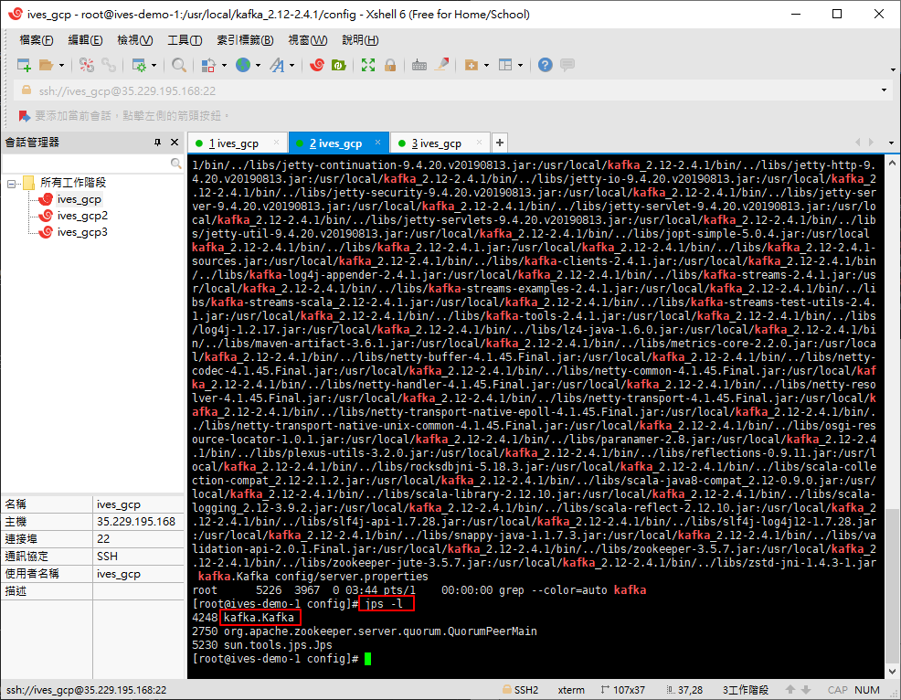

# Kafka

Kafka 筆記

# 消息隊列

消息隊列(Message Queue，MQ)，用來存儲消息的組件。

消息隊列不是一個永久性的存儲，是作為臨時存儲存在的。

# 消息隊列中間件

消息隊列中間件就是消息隊列組件。

目前市面上消息隊列中間件很多，如Kafka、RabbitMQ、ActiveMQ、RocketMQ、ZeroMQ。


# 消息隊列的應用場景

- 異步處理
    例如用戶註冊 -> 消息隊列 -> 同時 發送註冊郵件、發送註冊短信
- 系統解耦    
    例如 訂單系統 -> 消息隊列 -> 庫存系統
- 流量削峰
    用消息隊列的大吞吐量，快速處理用戶請求
- 日誌處理
    大數據領域常見    

# 消息隊列的兩種模式

- 生產者、消費者模型
    + 生產者負責將消息生產到MQ中
    + 消費者負責從MQ中獲取消息
    + 生產者和消費者是解耦的，可能是生產者一個程序，消費者是另外一個程序

- 消息隊列的模式
    + 點對點： 一個消費者消費一個消息
    + 發布、訂閱： 多個消費者可以消費一個消費

# 什麼是Kafka

Kafka是由Apache軟體基金會開發的一個開源流平台，由Scala和Java編寫。

Kafka是一個分布式流平台，一個分布式的流平台應該包含3點關鍵的能力：
1. 發布和訂閱流數據流，類似消息隊列或者是企業消息傳遞系統。(Publish and Subscribe)
2. 以容錯的持久化方式存儲數據流。(Store)
3. 處理數據流。(Process)

# Kafka官網

https://kafka.apache.org/


中文文檔

https://kafka.apachecn.org/


# Kafka下載及安裝

下載 - kafka_2.12-2.4.1.tgz

https://kafka.apache.org/downloads


上傳到GCP 服務器

```bash
rz
```


解壓縮

```
tar -zxvf kafka_2.12-2.4.1.tgz 
```


修改server.properties

先備份一份設置檔再作修改

```bash
cd /usr/local/kafka_2.12-2.4.1/config
cp server.properties server_bak.properties
vi server.properties
```


# GCP上新增其它兩台機器

這次會用到三台機器

需要再新增兩台


將kafka_2.12-2.4.1.tgz拷貝到這兩台新機器

安裝rz

```bash
yum install -y lrzsz
```


將kafka上傳到機器

```bash
rz
```


分別都解壓縮

```
tar -zxvf kafka_2.12-2.4.1.tgz 
```

並修改配置檔

```bash
cd /usr/local/kafka_2.12-2.4.1/config
cp server.properties server_bak.properties
vi server.properties
```


新機器沒有java環境，需先安裝jdk

```bath
 yum  install  -y  java-1.8.0-openjdk.x86_64
 java -verson
```

# 運行kafka

本來想用三台機器搭建集群的kafka，但碰到一些問題

先使用ives_gcp2單台運行kafka

```bash
cd /usr/local/kafka_2.12-2.4.1
bin/zookeeper-server-start.sh config/zookeeper.properties
```


```bash
bin/kafka-server-start.sh config/server.properties
```

成功運行


```bash
bin/kafka-topics.sh --bootstrap-server
```

# 改用ives_gcp操作

這機器本身已經有安裝zookeeper，所以想用這台直接操作

先作單台機器的練習，之後有機會再作集群的練習

參考相關文檔

https://github.com/IvesShe/Java_ZooKeeper

啟動zookeeper


修改kafak配置檔

除了broker.id及log目錄外，要再檢查打開一項設定

```properties
# 不同機器不同id
broker.id=0 

# 自定log目錄
log.dirs=/tmp/kafka-logs

listeners=PLAINTEXT://:9092

# zookeeper服務位址
zookeeper.connect=localhost:2181
```


成功運行kafka

```bash
bin/kafka-server-start.sh config/server.properties
```


查看進程，zookeeper跟kafka都成功的運行了

```
jps -l
```



# Kafka測試消息生產與消費

首先創建一個主題，命令如下

```bash
bin/kafka-topics.sh -zookeeper localhost:2181 --create --topic ivesmsg --partitions 2 --replication-factor 1

# --zookeeper：指定kafka新連接的zookeeper服務地址
# --topic：指定所要創建主題的名稱
# --partitions：指定分區個數
# --replication-factor：指定副本因子
# --create：創建主題的動作指令
```

創建成功


