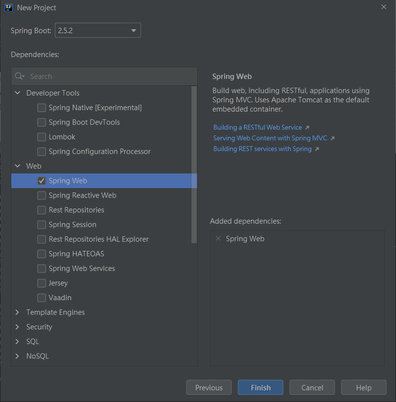
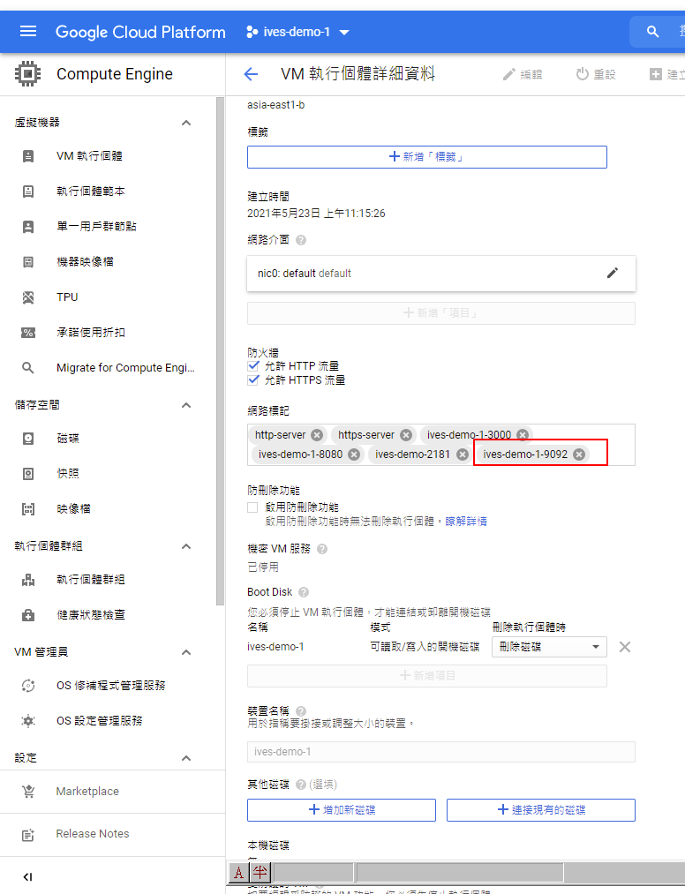

# Kafka

Kafka 筆記

# 消息隊列

消息隊列(Message Queue，MQ)，用來存儲消息的組件。

消息隊列不是一個永久性的存儲，是作為臨時存儲存在的。

# 消息隊列中間件

消息隊列中間件就是消息隊列組件。

目前市面上消息隊列中間件很多，如Kafka、RabbitMQ、ActiveMQ、RocketMQ、ZeroMQ。


# 消息隊列的應用場景

- 異步處理
    例如用戶註冊 -> 消息隊列 -> 同時 發送註冊郵件、發送註冊短信
- 系統解耦    
    例如 訂單系統 -> 消息隊列 -> 庫存系統
- 流量削峰
    用消息隊列的大吞吐量，快速處理用戶請求
- 日誌處理
    大數據領域常見    

# 消息隊列的兩種模式

- 生產者、消費者模型
    + 生產者負責將消息生產到MQ中
    + 消費者負責從MQ中獲取消息
    + 生產者和消費者是解耦的，可能是生產者一個程序，消費者是另外一個程序

- 消息隊列的模式
    + 點對點： 一個消費者消費一個消息
    + 發布、訂閱： 多個消費者可以消費一個消費

# 什麼是Kafka

Kafka是由Apache軟體基金會開發的一個開源流平台，由Scala和Java編寫。

Kafka是一個分布式流平台，一個分布式的流平台應該包含3點關鍵的能力：
1. 發布和訂閱流數據流，類似消息隊列或者是企業消息傳遞系統。(Publish and Subscribe)
2. 以容錯的持久化方式存儲數據流。(Store)
3. 處理數據流。(Process)

# Kafka官網

https://kafka.apache.org/


中文文檔

https://kafka.apachecn.org/


# Kafka下載及安裝

下載 - kafka_2.12-2.4.1.tgz

https://kafka.apache.org/downloads


上傳到GCP 服務器

```bash
rz
```


解壓縮

```
tar -zxvf kafka_2.12-2.4.1.tgz 
```


修改server.properties

先備份一份設置檔再作修改

```bash
cd /usr/local/kafka_2.12-2.4.1/config
cp server.properties server_bak.properties
vi server.properties
```


# GCP上新增其它兩台機器

這次會用到三台機器

需要再新增兩台


將kafka_2.12-2.4.1.tgz拷貝到這兩台新機器

安裝rz

```bash
yum install -y lrzsz
```


將kafka上傳到機器

```bash
rz
```


分別都解壓縮

```
tar -zxvf kafka_2.12-2.4.1.tgz 
```

並修改配置檔

```bash
cd /usr/local/kafka_2.12-2.4.1/config
cp server.properties server_bak.properties
vi server.properties
```


新機器沒有java環境，需先安裝jdk

```bath
 yum  install  -y  java-1.8.0-openjdk.x86_64
 java -verson
```

# 運行kafka

本來想用三台機器搭建集群的kafka，但碰到一些問題

先使用ives_gcp2單台運行kafka

```bash
cd /usr/local/kafka_2.12-2.4.1
bin/zookeeper-server-start.sh config/zookeeper.properties
```


```bash
bin/kafka-server-start.sh config/server.properties
```

成功運行


```bash
bin/kafka-topics.sh --bootstrap-server
```

# 改用ives_gcp操作

這機器本身已經有安裝zookeeper，所以想用這台直接操作

先作單台機器的練習，之後有機會再作集群的練習

zookeeper參考文檔

https://github.com/IvesShe/Java_ZooKeeper

啟動zookeeper


修改kafak配置檔

除了broker.id及log目錄外，要再檢查zookeeper跟再打開一項設定

```properties
# 不同機器不同id
broker.id=0 

# 自定log目錄
log.dirs=/tmp/kafka-logs

listeners=PLAINTEXT://:9092

# zookeeper服務位址
zookeeper.connect=localhost:2181
```


成功運行kafka

```bash
bin/kafka-server-start.sh config/server.properties
```


查看進程，zookeeper跟kafka都成功的運行了

```
jps -l
```


# Kafka測試消息生產與消費

首先創建一個主題ivesmsg，命令如下

```bash
bin/kafka-topics.sh -zookeeper localhost:2181 --create --topic ivesmsg --partitions 2 --replication-factor 1

# --zookeeper：指定kafka新連接的zookeeper服務地址
# --topic：指定所要創建主題的名稱
# --partitions：指定分區個數
# --replication-factor：指定副本因子
# --create：創建主題的動作指令
```

創建成功


# 展示所有主題

```bash
bin/kafka-topics.sh --zookeeper localhost:2181 --list
```


# 查看主題詳情

```bash
bin/kafka-topics.sh --zookeeper localhost:2181 --describe --topic ivesmsg
```


# 啟動消費端接收消息

```bash
bin/kafka-console-consumer.sh --bootstrap-server localhost:9092 --topic ivesmsg

# --bootstrap-server：指定連接kafka集群的地址
# --topic：指定消費端訂閱的主題

```

# 生產端發送消息

```bash
bin/kafka-console-producer.sh --broker-list localhost:9092 --topic ivesmsg

# --bootstrap-list：指定連接kafka集群的地址
# --topic：指定發送消息時的主題
```

生產端發送消息


消費者順利接收到消息


# 使用Java程序來進行Kafka收發消息

創建新專案





pom.xml

```xml
<?xml version="1.0" encoding="UTF-8"?>
<project xmlns="http://maven.apache.org/POM/4.0.0" xmlns:xsi="http://www.w3.org/2001/XMLSchema-instance"
         xsi:schemaLocation="http://maven.apache.org/POM/4.0.0 https://maven.apache.org/xsd/maven-4.0.0.xsd">
    <modelVersion>4.0.0</modelVersion>
    <parent>
        <groupId>org.springframework.boot</groupId>
        <artifactId>spring-boot-starter-parent</artifactId>
        <version>2.5.2</version>
        <relativePath/> <!-- lookup parent from repository -->
    </parent>
    <groupId>com.ives</groupId>
    <artifactId>kafka-exercise-01</artifactId>
    <version>0.0.1-SNAPSHOT</version>
    <name>kafka-exercise-01</name>
    <description>Demo project for Spring Boot</description>
    <properties>
        <java.version>1.8</java.version>
        <scala.version>2.11</scala.version>
        <slf4j.version>1.7.21</slf4j.version>
        <kafka.version>2.0.0</kafka.version>
        <lombok.version>1.18.8</lombok.version>
        <junit.version>4.11</junit.version>
        <protostuff.version>1.5.4</protostuff.version>
        <spark.version>2.3.1</spark.version>
    </properties>

    <dependencies>
        <dependency>
            <groupId>org.springframework.boot</groupId>
            <artifactId>spring-boot-starter-web</artifactId>
        </dependency>

        <dependency>
            <groupId>org.springframework.boot</groupId>
            <artifactId>spring-boot-starter-test</artifactId>
            <scope>test</scope>
        </dependency>

        <dependency>
            <groupId>org.apache.kafka</groupId>
            <artifactId>kafka-clients</artifactId>
            <version>${kafka.version}</version>
        </dependency>

        <dependency>
            <groupId>org.apache.kafka</groupId>
            <artifactId>kafka_${scala.version}</artifactId>
            <version>${kafka.version}</version>
            <exclusions>
                <exclusion>
                    <groupId>org.apache.zookeeper</groupId>
                    <artifactId>zookeeper</artifactId>
                </exclusion>
                <exclusion>
                    <groupId>org.slf4j</groupId>
                    <artifactId>slf4j-log4j12</artifactId>
                </exclusion>
                <exclusion>
                    <groupId>log4j</groupId>
                    <artifactId>log4j</artifactId>
                </exclusion>
            </exclusions>
        </dependency>

        <dependency>
            <groupId>org.slf4j</groupId>
            <artifactId>slf4j-log4j12</artifactId>
            <version>${slf4j.version}</version>
        </dependency>

        <dependency>
            <groupId>com.google.code.gson</groupId>
            <artifactId>gson</artifactId>
            <version>${gson.version}</version>
        </dependency>

        <dependency>
            <groupId>junit</groupId>
            <artifactId>junit</artifactId>
            <version>${junit.version}</version>
            <scope>test</scope>
        </dependency>

        <dependency>
            <groupId>org.projectlombok</groupId>
            <artifactId>lombok</artifactId>
            <version>${lombok.version}</version>
            <scope>provided</scope>
        </dependency>

        <dependency>
            <groupId>io.protostuff</groupId>
            <artifactId>protostuff-core</artifactId>
            <version>${protostuff.version}</version>
        </dependency>

        <dependency>
            <groupId>io.protostuff</groupId>
            <artifactId>protostuff-runtime</artifactId>
            <version>${protostuff.version}</version>
        </dependency>

        <dependency>
            <groupId>com.fasterxml.jackson.core</groupId>
            <artifactId>jackson-core</artifactId>
            <version>2.9.4</version>
        </dependency>

        <dependency>
            <groupId>com.fasterxml.jackson.module</groupId>
            <artifactId>jackson-module-scala_2.11</artifactId>
            <version>2.9.5</version>
        </dependency>

        <dependency>
            <groupId>org.apache.spark</groupId>
            <artifactId>spark-streaming_${scala.version}</artifactId>
            <version>${spark.version}</version>
        </dependency>

        <dependency>
            <groupId>org.apache.spark</groupId>
            <artifactId>spark-streaming_${scala.version}</artifactId>
            <version>${spark.version}</version>
        </dependency>

        <dependency>
            <groupId>org.apache.spark</groupId>
            <artifactId>spark-sql_${scala.version}</artifactId>
            <version>${spark.version}</version>
        </dependency>

        <dependency>
            <groupId>org.apache.spark</groupId>
            <artifactId>spark-sql-kafka-0-10_${scala.version}</artifactId>
            <version>${spark.version}</version>
        </dependency>
    </dependencies>

    <build>
        <plugins>
            <plugin>
                <groupId>org.springframework.boot</groupId>
                <artifactId>spring-boot-maven-plugin</artifactId>
            </plugin>
        </plugins>
    </build>

</project>

```

ProducerFastStart.java

```java
package com.ives.kafka;

import kafka.tools.ConsoleProducer;
import org.apache.kafka.clients.producer.KafkaProducer;
import org.apache.kafka.clients.producer.ProducerConfig;
import org.apache.kafka.clients.producer.ProducerRecord;
import org.apache.kafka.clients.producer.RecordMetadata;
import org.apache.kafka.common.serialization.StringSerializer;

import java.util.Properties;
import java.util.concurrent.Future;

public class ProducerFastStart {

    private static final String brokerList = "35.229.195.168:9092";
    private static final String topic = "ivesmsg";

    public static void main(String[] args) {
        Properties properties = new Properties();

        // 設置key序列化器
        properties.put("key.serializer","org.apache.kafka.common.serialization.StringSerializer");
        properties.put(ProducerConfig.KEY_SERIALIZER_CLASS_CONFIG, StringSerializer.class.getName());

        // 設置重試次數
        properties.put(ProducerConfig.RETRIES_CONFIG,10);

        // 設置值序列化器
        //properties.put("value.serializer","org.apache.kafka.common.serialization.StringSerializer");
        properties.put(ProducerConfig.VALUE_SERIALIZER_CLASS_CONFIG,StringSerializer.class.getName());

        // 設置集群地址
        //properties.put("bootstrap.servers",brokerList);
        properties.put(ProducerConfig.BOOTSTRAP_SERVERS_CONFIG,brokerList);

        KafkaProducer<String,String> producer = new KafkaProducer<String, String>(properties);
        ProducerRecord<String,String> record = new ProducerRecord<>(topic,"kafka-demo","i am java API");

        try {
            producer.send(record);
        }catch (Exception e){
            e.printStackTrace();
        }

        producer.close();
    }
}

```

ConsumerFastStart.java

```java
package com.ives.kafka;

import kafka.server.KafkaConfig;
import org.apache.kafka.clients.consumer.ConsumerConfig;
import org.apache.kafka.clients.consumer.ConsumerRecord;
import org.apache.kafka.clients.consumer.ConsumerRecords;
import org.apache.kafka.clients.consumer.KafkaConsumer;
import org.apache.kafka.clients.producer.ProducerConfig;
import org.apache.kafka.common.serialization.StringDeserializer;
import org.apache.kafka.common.serialization.StringSerializer;

import java.time.Duration;
import java.util.Collections;
import java.util.Properties;

public class ConsumerFastStart {

    private static final String brokerList = "35.229.195.168:9092";
    private static final String topic = "ivesmsg";
    private static final String groupId = "group.demo";

    public static void main(String[] args) {

        Properties properties = new Properties();

        // 設置key序列化器
//        properties.put("key.deserializer","org.apache.kafka.common.serialization.StringDeserializer");
        properties.put(ConsumerConfig.KEY_DESERIALIZER_CLASS_CONFIG, StringDeserializer.class.getName());

        // 設置重試次數
        //properties.put(ProducerConfig.RETRIES_CONFIG,10);

        // 設置值序列化器
//        properties.put("value.deserializer","org.apache.kafka.common.serialization.StringDeserializer");
        properties.put(ConsumerConfig.VALUE_DESERIALIZER_CLASS_CONFIG,StringDeserializer.class.getName());

        // 設置集群地址
//        properties.put("bootstrap.servers",brokerList);
        properties.put(ConsumerConfig.BOOTSTRAP_SERVERS_CONFIG,brokerList);

//        properties.put("group.id",groupId);
        properties.put(ConsumerConfig.GROUP_ID_CONFIG,groupId);

        KafkaConsumer<String,String> consumer = new KafkaConsumer<String, String>(properties);
        consumer.subscribe(Collections.singletonList(topic));

        while (true){
            ConsumerRecords<String,String> records = consumer.poll(Duration.ofMillis(1000));
            for(ConsumerRecord<String,String> record:records){
                System.out.println(record.value());
            }
        }
    }
}


```

# GCP的服務器 9092端口 安全組先打開




# 運行發現問題

```bath

org.apache.kafka.common.KafkaException: Socket server failed to bind to ... Cannot assign requested address.

```

上網爬文了一下，發現是kafka配置的問題，修改成這樣，就可以透過java程序連接kafka服務器了


# 運行結果

ProducerFastStart


ConsumerFastStart


